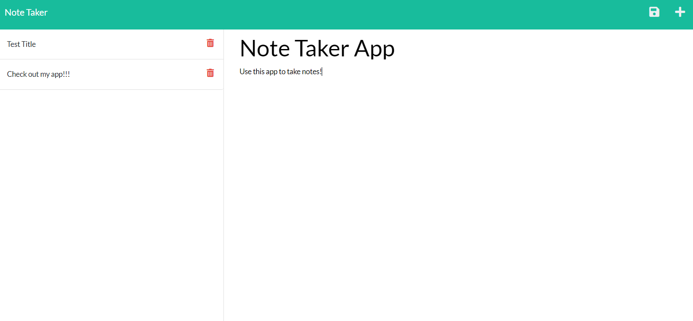

# Note-Taker-App
## Badge 

## Description 
This application was built so that a user can enter a title for a note. Then a description for that note and be able to save it so they can view it later. They can also re-visit the note and still use the plus button to open a new note. The user can also hit the delete button to remove a not if at all necessary. 

## Deployed Application
[Note taker](https://dry-stream-10950.herokuapp.com/)

## Table of Contents (Optional)
- [Demo](#demo)
- [License](#license)
- [Technologies](#technologies)
- [Usage](#usage)
- [E-mail](#e-mail)

## Demo
[Click here: Note taker Demo](https://watch.screencastify.com/v/54ysIz1xZnZj1oTfJFrq)

## License
MIT License
Permission is hereby granted, free of charge, to any person obtaining a copy of this software and associated documentation files the Software, to deal in the Software without restriction, including without limitation the rights to use, copy, modify, merge, publish, distribute, sublicense, and/or sell copies of the Software, and to permit persons to whom the Software is furnished to do so, subject to the following conditions. Click on Badge for more info.

## Technologies
- Express.js
- Node.js
- Uuid

## Usage
- Clone this repository to your local machine.
- Run NPM i to install all necessary dependencies.
- Open server.js in Integrated terminal and type node.js.
- Use Ctrl + click on the Localhost:3001 link. 

## features
- Express.js to build the server.
- fs (file system) module to read and write db.json file.
- Uuid to give each note a unique id. 
- Heroku was used for the deployment of the application. 

## Questions
### Username
<a href="https://github.com/Skruphold">Skruphold</a>
### E-mail
<a href="mailto: Hunterco999@gmail.com">Hunterco999@gmail.com</a>